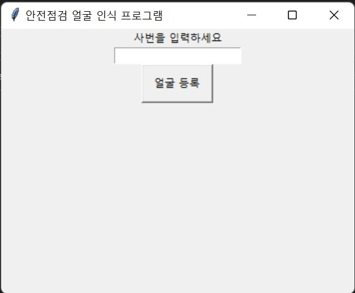

# 2022-06-26 현재 진행상황
1. 사번 등록으로 폴더 생성
2. 웹캠 오픈, 얼굴 검출된 사진만 프레임 추출

# 남은 작업
1. 검출과 등록 버튼을 가진 최초 gui 만들기
2. 얼굴 학습 소스코드랑 합치기

**************
</img>
**************

## 참고자료
1. Media Pipe face Detection[^1].

[^1]: https://google.github.io/mediapipe/solutions/face_detection